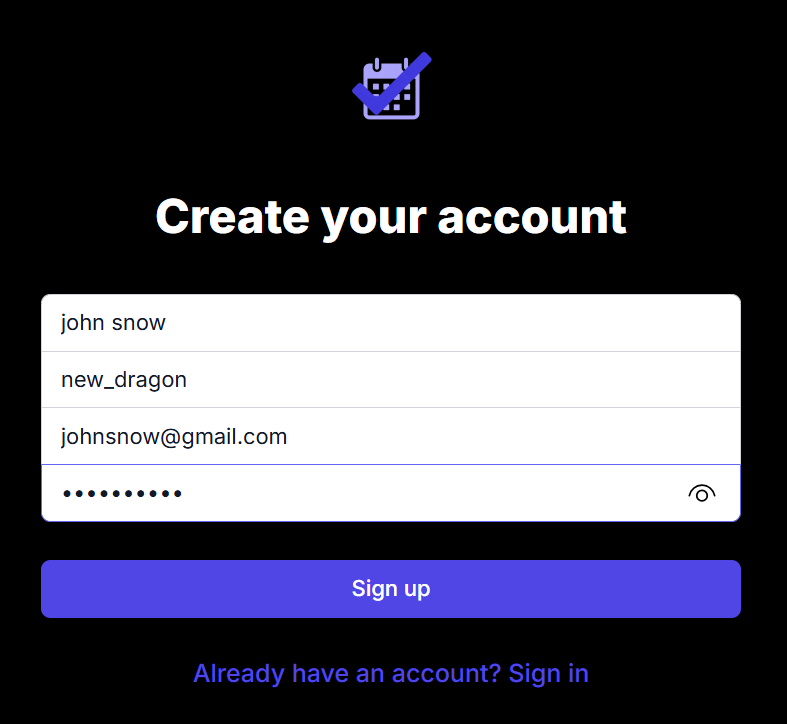
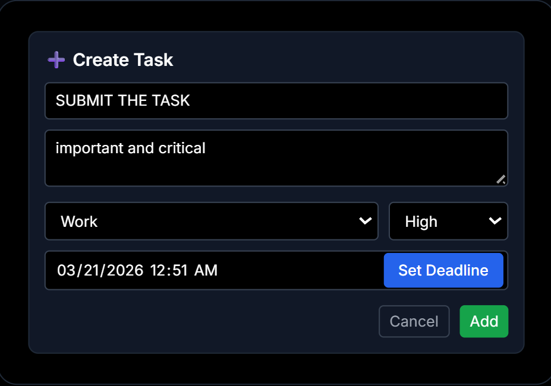

# Task Management System

A full-stack web application for managing personal tasks with secure authentication and comprehensive internal architecture.

## 🚀 Features

- **User Authentication**: Secure registration, login, and logout with JWT tokens
- **Task Management**: Create, read, update, and delete tasks
- **Advanced Filtering**: Search tasks, filter by category and priority
- **Pagination**: Efficient handling of large task lists
- **Token Refresh**: Automatic token refresh for seamless user experience
- **Responsive Design**: Mobile-friendly interface using Tailwind CSS
- **Toast Notifications**: User-friendly feedback system
- **Analytics Dashboard**: Task statistics and completion tracking

## 🏗️ Internal Architecture

### System Overview
The application follows a clean separation of concerns with a REST API backend and SPA frontend, connected through JWT-based authentication.

### Data Flow
```
Frontend (Next.js) → API Layer (Express) → Business Logic → Database (PostgreSQL)
                    ↓
                JWT Authentication
```

### Component Relationships
- **Backend**: Express.js server with Prisma ORM for database operations
- **Frontend**: Next.js SPA with React hooks for state management
- **Authentication**: JWT access tokens (15min) + refresh tokens (7days)
- **Database**: PostgreSQL with Prisma migrations

## 📁 File Structure

```
task-management/
├── backend/
│   ├── src/
│   │   ├── app.ts              # Express server setup and middleware
│   │   ├── controllers/        # Authentication and task logic
│   │   ├── middleware/         # JWT verification and error handling
│   │   ├── routes/            # API endpoint definitions
│   │   ├── services/          # Database operations
│   │   └── utils/             # JWT and validation utilities
│   ├── prisma/
│   │   └── schema.prisma      # Database schema definition
│   └── package.json
├── frontend/
│   ├── app/
│   │   ├── components/        # React components (TaskForm, TaskCard, Sidebar)
│   │   ├── dashboard/         # Main dashboard interface
│   │   ├── login/            # User authentication pages
│   │   ├── analytics/        # Statistics dashboard
│   │   └── services/         # API integration and authentication
│   ├── public/               # Static assets and logo
│   └── package.json
└── README.md
```

## ⚙️ Functionality Details

### Authentication System
**Internal Flow:**
1. **Registration**: Password hashing with bcrypt → User creation in database
2. **Login**: Credential verification → JWT token generation → Token storage
3. **API Authentication**: Bearer token verification → User context injection
4. **Token Refresh**: Automatic background refresh when access token expires
5. **Logout**: Token clearance from localStorage

### Task Management System
**CRUD Operations:**
- **Create**: Title validation, category/priority assignment, deadline parsing
- **Read**: Pagination (10 items/page), search, filtering, sorting
- **Update**: Partial updates with validation, completion tracking
- **Delete**: User authorization required

**Filtering & Sorting:**
- **Search**: Full-text search in title and description
- **Categories**: WORK, PERSONAL, HOME, FINANCIAL, CUSTOM
- **Priorities**: LOW, HIGH (simplified from three levels)
- **Sorting**: deadline, createdAt, priority (ascending/descending)

### State Management
**Frontend State:**
- **Authentication**: localStorage for tokens, React hooks for user state
- **Tasks**: Server state with optimistic updates
- **UI State**: Component-level state for forms and filters
- **Error Handling**: Global toast notifications

## 🗄️ Database Schema

### Users Table
- `id` (Primary Key)
- `name`, `username`, `email` (User information)
- `password` (bcrypt hashed)
- `created_at`, `updated_at` (Timestamps)

### Tasks Table
- `id` (Primary Key)
- `title`, `description` (Task details)
- `completed` (Boolean status)
- `category`, `priority` (Classification)
- `deadline` (Optional timestamp)
- `user_id` (Foreign key to users)

## 🎨 Frontend Components

### Key Components
**TaskForm.tsx:**
- Form validation with controlled components
- Dynamic category/priority selection
- Datetime picker with "Set Deadline" button
- Optimistic updates for better UX

**TaskCard.tsx:**
- Individual task display with actions
- Priority badges with color coding
- Completion toggle with instant feedback
- Edit/delete functionality

**Sidebar.tsx:**
- Navigation menu with active state
- User profile display with avatar
- Task statistics overview
- Logout functionality

## 📱 Screenshots

### Dashboard View

*Main task management interface with sidebar, task list, and filtering options*

### Task Creation Form

*Modal form for creating and editing tasks with all fields and validation*

### Login/Register Pages

*Clean login and registration interfaces with form validation*

### Analytics Dashboard

*Task statistics and completion analytics with charts*

### Mobile Responsive View

*Responsive design optimized for mobile devices*

## �️ Tech Stack

### Backend
- **Node.js** + **TypeScript**
- **Express.js** framework
- **Prisma ORM** with PostgreSQL
- **JWT Authentication** (access + refresh tokens)
- **bcrypt** for password hashing
- **express-validator** for input validation

### Frontend
- **Next.js 14** (App Router)
- **TypeScript**
- **Tailwind CSS** for styling
- **Axios** for API calls
- **React Hot Toast** for notifications

## 🔒 Security Features

- **Password Hashing**: bcrypt with salt rounds (10)
- **JWT Tokens**: Short-lived access tokens with refresh mechanism
- **Input Validation**: Server-side validation with sanitization
- **TypeScript**: Type safety throughout the application
- **CORS**: Proper cross-origin resource sharing configuration
