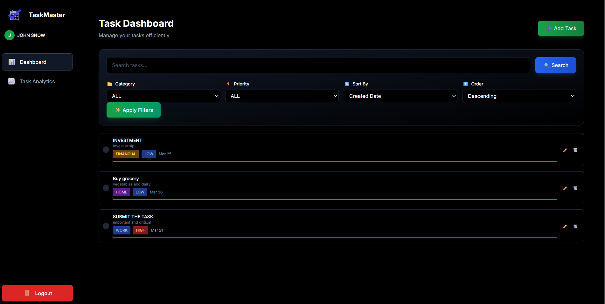
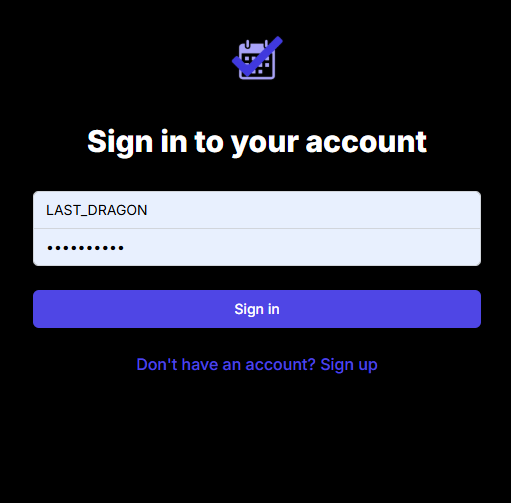
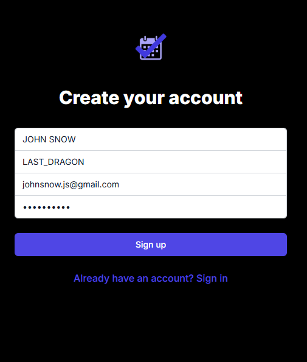
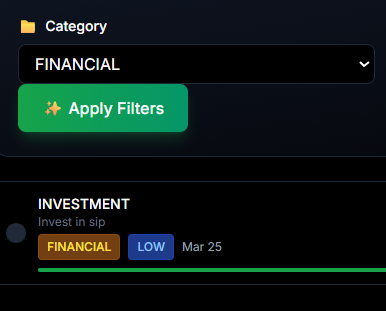
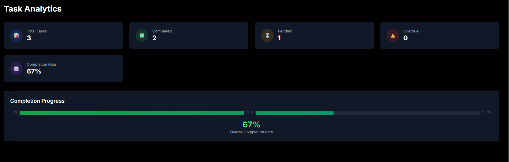

# Task Management System — Spring Boot Version

A full-stack web application for managing personal tasks with secure authentication and comprehensive internal architecture.

> **Branch:** `spring-boot-version` — This branch replaces the Node.js/TypeScript backend with **Spring Boot (Java 21)** while keeping the frontend identical.

## ✨ Features

- **User Authentication**: Secure registration, login, and logout with JWT tokens
- **Task Management**: Create, read, update, and delete tasks
- **Advanced Filtering**: Search tasks, filter by category and priority
- **Pagination**: Efficient handling of large task lists
- **Token Refresh**: Automatic token refresh for seamless user experience
- **Responsive Design**: Mobile-friendly interface using Tailwind CSS
- **Toast Notifications**: User-friendly feedback system
- **Analytics Dashboard**: Task statistics and completion tracking

## 🏗️ Internal Architecture

### System Overview
```
Frontend (Next.js) → API Layer (Spring Boot) → Business Logic → Database (PostgreSQL)
                          ↑
                   Spring Security + JWT
```

### Component Relationships
- **Backend**: Spring Boot 3.2 with Spring Data JPA (Hibernate) for database operations
- **Frontend**: Next.js SPA with React hooks for state management
- **Authentication**: Spring Security + JWT access tokens (15min) + refresh tokens (7days)
- **Database**: PostgreSQL with Hibernate auto DDL

## 📁 File Structure

```
task-management/
├── backend/                         # Spring Boot Java backend
│   ├── pom.xml                      # Maven dependencies
│   ├── Procfile                     # Railway/Heroku deployment
│   ├── nixpacks.toml                # Nixpacks build config
│   └── src/
│       └── main/
│           ├── java/com/taskmanager/
│           │   ├── TaskManagerApplication.java   # Entry point
│           │   ├── controller/                   # REST controllers
│           │   │   ├── AuthController.java
│           │   │   ├── TaskController.java
│           │   │   └── HealthController.java
│           │   ├── service/                      # Business logic
│           │   │   ├── AuthService.java
│           │   │   └── TaskService.java
│           │   ├── model/                        # JPA entities
│           │   │   ├── User.java
│           │   │   └── Task.java
│           │   ├── repository/                   # Spring Data JPA
│           │   │   ├── UserRepository.java
│           │   │   └── TaskRepository.java
│           │   ├── dto/                          # Request/Response DTOs
│           │   │   ├── ApiResponse.java
│           │   │   ├── AuthResponse.java
│           │   │   ├── LoginRequest.java
│           │   │   ├── RegisterRequest.java
│           │   │   ├── TaskRequest.java
│           │   │   ├── TaskStatsResponse.java
│           │   │   ├── PaginatedTasksResponse.java
│           │   │   └── RefreshRequest.java
│           │   ├── security/                     # Spring Security + JWT
│           │   │   ├── SecurityConfig.java
│           │   │   ├── JwtTokenProvider.java
│           │   │   ├── JwtAuthenticationFilter.java
│           │   │   └── UserPrincipal.java
│           │   └── exception/                    # Global error handling
│           │       └── GlobalExceptionHandler.java
│           └── resources/
│               └── application.properties        # App configuration
├── frontend/                        # Next.js frontend (identical to main)
│   ├── app/
│   │   ├── components/              # React components (TaskForm, TaskCard, Sidebar)
│   │   ├── dashboard/               # Main dashboard
│   │   ├── login/                   # Login page
│   │   ├── register/                # Register page
│   │   ├── analytics/               # Stats dashboard
│   │   └── services/                # API integration
│   ├── package.json
│   └── next.config.js
├── .env.example                     # Environment variable template
├── railway.toml                     # Railway multi-service config
└── README.md
```

## ⚙️ Local Development Setup

### Prerequisites
- Java 21+
- Maven 3.8+
- Node.js 18+
- PostgreSQL database

### 1. Clone & configure environment

```bash
git clone https://github.com/spidyraj/task_management_trial.git
git checkout spring-boot-version
cp .env.example .env
# Fill in your database and JWT values in .env
```

### 2. Start the Spring Boot backend

```bash
cd backend
mvn spring-boot:run
# Server starts on http://localhost:5000
```

### 3. Start the Next.js frontend

```bash
cd frontend
npm install
npm run dev
# App opens on http://localhost:3000
```

## 🔌 API Endpoints

| Method | Path | Auth | Description |
|--------|------|------|-------------|
| POST | `/api/auth/register` | No | Register new user |
| POST | `/api/auth/login` | No | Login (email or username) |
| POST | `/api/auth/refresh` | No | Refresh access token |
| POST | `/api/auth/logout` | No | Logout |
| GET | `/api/tasks` | ✅ | Get tasks (filter/paginate) |
| POST | `/api/tasks` | ✅ | Create task |
| PATCH | `/api/tasks/:id` | ✅ | Update task |
| DELETE | `/api/tasks/:id` | ✅ | Delete task |
| PATCH | `/api/tasks/:id/toggle` | ✅ | Toggle completion |
| GET | `/api/tasks/stats` | ✅ | Get task statistics |
| GET | `/api/health` | No | Health check |

## 🔐 Environment Variables (Backend)

| Variable | Description | Example |
|----------|-------------|---------|
| `DB_URL` | JDBC PostgreSQL URL | `jdbc:postgresql://localhost:5432/taskdb` |
| `DB_USERNAME` | Database user | `postgres` |
| `DB_PASSWORD` | Database password | `secret` |
| `JWT_SECRET` | Access token secret (≥32 chars) | `your-secret-here` |
| `JWT_REFRESH_SECRET` | Refresh token secret (≥32 chars) | `your-refresh-secret` |
| `JWT_ACCESS_EXP_MS` | Access token expiry ms | `900000` (15 min) |
| `JWT_REFRESH_EXP_MS` | Refresh token expiry ms | `604800000` (7 days) |
| `FRONTEND_URL` | Frontend URL for CORS | `http://localhost:3000` |

## 🗄️ Database Schema

### Users Table
- `id` (PK, auto-increment)
- `name`, `username` (unique), `email` (unique)
- `password` (BCrypt hashed)
- `created_at`, `updated_at`

### Tasks Table
- `id` (PK, auto-increment)
- `title`, `description`
- `completed` (boolean, default false)
- `category` (default: PERSONAL), `priority` (default: MEDIUM)
- `deadline` (nullable timestamp)
- `user_id` (FK → users)

## 🔄 Difference from `main` Branch

| Feature | `main` (TypeScript) | `spring-boot-version` (Java) |
|---------|---------------------|------------------------------|
| Runtime | Node.js | JVM (Java 21) |
| Framework | Express.js | Spring Boot 3.2 |
| ORM | Prisma | Spring Data JPA (Hibernate) |
| Auth | Custom JWT middleware | Spring Security + JWT |
| Validation | express-validator | Jakarta Bean Validation |
| Build | TypeScript compiler | Maven |
| API surface | Identical | Identical |
| Frontend | Next.js | Next.js (unchanged) |

## 🛡️ Security Features

- **Password Hashing**: BCrypt via Spring Security
- **JWT Tokens**: Short-lived access tokens + refresh token rotation
- **Input Validation**: Bean Validation (`@Valid`, `@NotBlank`, `@Size`)
- **CORS**: Configurable via `app.frontend.url` property
- **Stateless**: No server-side sessions (JWT-only)

## 📸 Screenshots

### Main Application Page


### Register Page


### Login Page


### Task Creation Form


### Task Filter View


### Dashboard Analytics

